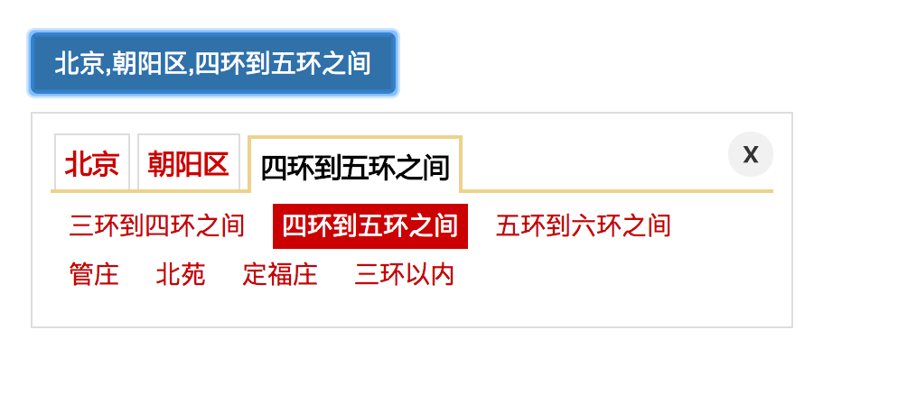

JAreaSelect
========
>url:    /template/default/script/JAreaSelect.js;<br>
接口开发：yangjian102621@gmail.com<br>
文档编写：yangjian

插件描述:
--------
JAreaSelect区域选择插件是一个区域选择的js插件。数据是抓取京东的最新的区域数据。
很全面，大约5000多条，涵盖了中国所有的地区，包括钓鱼岛在内。提供了普通样式和仿京东样式的小工具，另外还提供了一个超级简陋的管理界面，
由于是个小项目，图省事，就不想引入什么框架的，直接原生写的，不喜欢请勿拍砖。

插件依赖:
-------
* jquery 1.1.1

示例代码:
-------
```html
    <!--html代码-->
    <p><button class="btn btn-primary">显示选中区域</button></p>
    <div id="area-select-box" class="form-inline"></div>
```
```javascript
    //普通样式
   var area = $("#area-select-box").JAreaSelect({
   	    prov : 1,
   	    city : 72,
   	    dist : 2839,
   });
   
   $(".btn-primary").on('click', function() {
       alert(area.getAreaString());
       console.log(area.getAreaId());
   });
    
   //仿京东样式
   $("#area-select").JAreaSelect2({
       prov : 1,
       city : 72,
       dist : 2839,

       callback : function(data) {
        console.log(data);
           $(".btn-primary").html(data.address);
       }
   });
     
```
option参数说明:
-------------

Key  | 类型   | 说明
---|--- | ---
selectClassName| string  | select class 属性，用来方便你调节UI的
prov  | int | 初始化的省份ID
city  | int | 初始化城市ID
dist | int | 初始化地区ID

效果截图:
------------
#### 普通样式
 <br/>

#### 仿京东样式
 <br/>